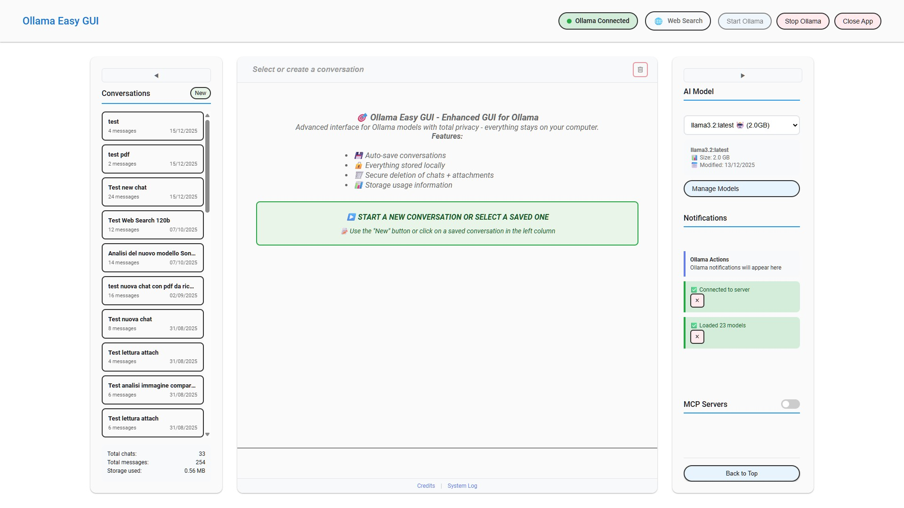
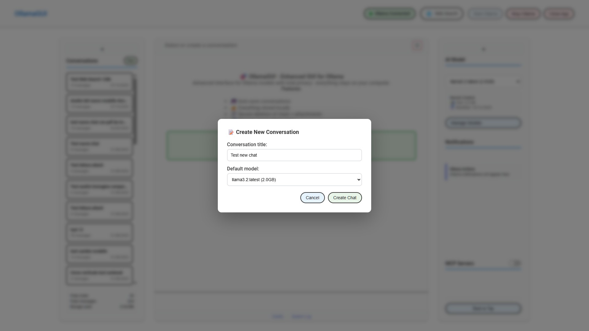

# Ollama Easy GUI

**Easy GUI for Ollama** - Professional chat interface for an already existing Ollama installation, with MCP support, web search, and privacy-first design.

[](https://github.com/paolodalprato/ollama-easy-gui)
[](LICENSE)
[](https://nodejs.org/)
[]()

## Screenshot



---

## Key Features

- **MCP Tool Support** - Model Context Protocol integration for external tools
- **Web Search** - Privacy-friendly search integrated in conversations
- **Ollama Hub Search** - Browse and download models directly from the GUI
- **Base Prompt per Model** - Persistent custom behavior for each model
- **Attachments** - PDF, DOCX, images, and text files support
- **Export** - Save conversations as Markdown, TXT, or Word
- **Material Design UI** - Clean, professional interface
- **Privacy First** - All data stays local, no cloud dependencies

---

## Features in Detail

### Core Chat
- **Model selection** - Choose from any Ollama model for each conversation
- **Real-time streaming** - Responses appear as they are generated
- **Base prompts** per-model with persistence
- **Attachments** support (PDF, DOCX, images, text)
- **Export** conversations to Markdown, TXT, or Word
- **Auto-save** all conversations locally

> **Note on language behavior**: When you attach documents, the AI model tends to respond in the document's language, even if your question is in a different language. This is a characteristic of how language models process context. For consistent language responses, ensure your base prompt, question, and attachments are in the same language.

### MCP Integration (Model Context Protocol)
Connect your AI to external tools - just like Claude Desktop:
- **Filesystem access** - Let AI read/write files
- **GitHub integration** - Query repositories
- **Custom MCP servers** - Extend with any MCP-compatible tool
- Visual indicators for tool execution in real-time

> **Note**: MCP requires models with **function calling** support. Compatible models include: `llama3.1`, `llama3.2`, `llama3.3`, `qwen2.5`, `mistral`, `command-r`, and others. See [MCP Model Compatibility](docs/documentation/MCP_MODEL_COMPATIBILITY.md) for the full list.

### Web Search
- **DuckDuckGo** powered - chosen for privacy (no tracking) and no API key required
- Automatic query reformulation for better results
- Source citations with clickable links
- "Web Enhanced" badge on enriched responses

### Ollama Hub Search
- Browse and download models from the **official Ollama model library**
- Category filters (Chat, Code, Reasoning, Multimodal)
- Download progress tracking
- No command line needed

### Privacy First
- **100% local** - All data stays on your machine
- **No cloud** - No API keys required for core functionality
- **No tracking** - Zero telemetry
- **File-based storage** - Your conversations in simple JSON files

> **Note on MCP and Privacy**: Some MCP servers act as bridges to external cloud services (e.g., GitHub API, NotebookLM, web search APIs). When using these, your queries and related context are sent to those external services - even if the MCP server itself runs locally on your machine. Only MCP servers that access purely local resources (e.g., filesystem, local databases) keep all data on your machine.

---

## Installation

> **Note**: This application has been developed and tested on **Windows**. It should work on macOS and Linux, but these platforms have not been tested yet. Feedback and contributions are welcome!

### Prerequisites

> **Important**: Ollama Easy GUI is an interface for Ollama. You must have **Ollama installed** on your system first.

1. **Install Ollama** (required): Download from [https://ollama.ai](https://ollama.ai)
2. **Install Git**: Download from [https://git-scm.com](https://git-scm.com)
3. **Install Node.js** 16.0.0 or higher: Download from [https://nodejs.org](https://nodejs.org)

### Quick Start

```bash
# Clone the repository
git clone https://github.com/paolodalprato/ollama-easy-gui.git

# Navigate to directory
cd ollama-easy-gui

# Install dependencies (first time only)
npm install

# Start the application
npm start
```

The GUI will open at `http://localhost:3003`

### Windows: Using start-ollama-easy-gui.bat (Recommended)

For Windows users, **double-click `start-ollama-easy-gui.bat`** instead of using `npm start`:
- **Optional update check** - prompts to run `git pull` (auto-skips after 5 seconds)
- Checks for Node.js installation
- **Configures Ollama GPU/CPU settings** (layers, threads, cache)
- Starts the server and opens the browser automatically


You can edit the `.bat` file to customize performance settings for your hardware:

```bat
:: Adjust these values based on your GPU/CPU
set "OLLAMA_GPU_LAYERS=18"          :: Number of layers to offload to GPU
set "OLLAMA_FLASH_ATTENTION=1"      :: Enable flash attention (faster)
set "OLLAMA_NUM_THREADS=24"         :: CPU threads for inference

:: Optional: Set a custom cache directory for Ollama models
:: Uncomment and modify the path to match your system
:: set "OLLAMA_CACHE_DIR=C:\your\custom\cache\path"
```

> **Difference**: `npm start` just runs the server. The `.bat` file also offers update checking and configures Ollama environment variables for optimal GPU/CPU usage.

### Updating

To update to the latest version:
```bash
git pull
npm install
```

---

## Screenshots Gallery

### Create New Conversation
Start a new chat by clicking "New" and selecting your preferred model:



### Chat with Export Options
Export any response in multiple formats - Markdown, Text, or Word:


### File Attachments
Attach files for AI analysis - single file, multiple files, or entire folders:


Attached files appear below the input area, ready to be analyzed:


### Collapsible Sidebars
Maximize chat area by collapsing both sidebars. Click the arrows to reopen:


### Local Model Management
View installed models with size, date, and category. Sort by name, category, size, or date:


### Hub Search & Download
Search Ollama Hub directly from the GUI. Download with real-time progress:


### Base Prompt Editor
Define custom behavior for each model with persistent base prompts:


### MCP Integration
Connect to MCP servers for extended capabilities - filesystem, GitHub, search APIs. **MCP must be explicitly enabled** using the toggle switch in the right sidebar before tools are sent to the model:


### MCP in Action
Use MCP tools during conversations for file access, data queries, and more:


---

## Usage

### Basic Chat
1. Select a model from the dropdown in the right sidebar
2. Click "New" to create a conversation
3. Type your message and press Enter or click "Send"

### Using MCP Tools
1. **Enable MCP** using the main toggle switch in the right sidebar
2. Configure and enable individual MCP servers in the MCP panel
3. Chat normally - the AI will use tools when needed
4. Watch tool execution indicators in real-time

> **Note**: MCP tools are available only when the main MCP toggle is ON.

### Web Search
1. Enable Web Search toggle in the right sidebar
2. Ask questions that benefit from current information
3. Sources appear below the response with clickable links

### Model Management
1. Click "Manage Models" button
2. **Local Models tab**: View, configure base prompts, or remove installed models
3. **Hub Search tab**: Search and download new models from Ollama Hub

### Base Prompts
1. In Model Management, click the prompt icon on any model
2. Define the AI's behavior and personality for that model
3. The prompt is automatically applied to all conversations with that model

---

## Configuration

### MCP Servers

Ollama Easy GUI supports these **official Anthropic MCP servers** (and any other MCP-compatible server):

| Server | Description | Requires API Key |
|--------|-------------|------------------|
| **filesystem** | Read/write files on your local machine | No |
| **github** | Access GitHub repositories | Yes (GITHUB_TOKEN) |

See [Anthropic MCP Servers](https://github.com/anthropics/mcp-servers) for more available servers.

#### First-time Setup

To enable MCP support, create the configuration file from the provided example:

```bash
# Copy the example file
cp app/data/mcp-config.json.example app/data/mcp-config.json
```

On Windows:
```cmd
copy app\data\mcp-config.json.example app\data\mcp-config.json
```

Then edit `app/data/mcp-config.json` to customize:

```json
{
  "mcpServers": {
    "filesystem": {
      "command": "npx",
      "args": ["-y", "@modelcontextprotocol/server-filesystem", "/path/to/allow"],
      "enabled": false,
      "description": "File system operations"
    },
    "github": {
      "command": "npx",
      "args": ["-y", "@modelcontextprotocol/server-github"],
      "env": { "GITHUB_PERSONAL_ACCESS_TOKEN": "your-token-here" },
      "enabled": false,
      "description": "GitHub repository access"
    }
  }
}
```

> **Tip**: Enable servers from the MCP panel in the right sidebar without editing the config file.

### Environment Variables
The application uses sensible defaults. Optional configuration:
- `PORT` - Server port (default: 3003)
- `OLLAMA_HOST` - Ollama API URL (default: http://localhost:11434)
- `NODE_ENV` - Environment mode (development, production, testing)

### Logging

Ollama Easy GUI includes a centralized logging system for troubleshooting. Logs are stored in `app/data/logs/`:

| Log File | Content |
|----------|---------|
| `mcp_*.log` | MCP server connections, tool executions, errors |
| `chat_*.log` | Chat streaming errors, tool failures, attachments |
| `models_*.log` | Model download, removal, warmup errors |
| `ollamagui_*.log` | Application startup, shutdown, general errors |

**Features:**
- Automatic log rotation (5MB per file, max 5 files per category)
- View logs from the GUI: click the **Log** button in the footer
- Filter by category and search text
- Delete old logs directly from the interface


> **Note**: Logs focus on errors and important events. Normal operations are not logged to keep files small and useful.

---

## Tech Stack

- **Backend**: Pure Node.js HTTP server (no Express)
- **Frontend**: Vanilla JavaScript (no frameworks)
- **Styling**: Material Design 3 inspired, 15 modular CSS files
- **Storage**: Local JSON files
- **Dependencies**: Only `pdf-parse` for PDF attachment support

### Architecture
```
ollama-easy-gui/
├── app/
│   ├── backend/
│   │   ├── server.js           # Entry point
│   │   ├── controllers/        # 9 API controllers
│   │   ├── core/               # Business logic (Ollama, Storage)
│   │   └── mcp/                # MCP client implementation
│   ├── frontend/
│   │   ├── index.html          # Single-page application
│   │   ├── css/                # 15 modular CSS files
│   │   └── js/                 # Components, managers, services
│   └── data/                   # Local storage (conversations, config)
├── docs/                       # Documentation
└── tests/                      # Test suites
```

---

## Performance

- **Boot Time**: ~12ms
- **API Response**: <100ms
- **Memory**: Stable with zero leaks
- **Concurrent Streams**: 100+ supported

---

## Versioning

This project follows [Semantic Versioning 2.0.0](https://semver.org/) (SemVer).

**Format: MAJOR.MINOR.PATCH**

| Change Type | Version Bump | Example |
|-------------|--------------|---------|
| Bug fixes, minor improvements | PATCH | 1.0.0 → 1.0.1 |
| New features (backward compatible) | MINOR | 1.0.1 → 1.1.0 |
| Breaking changes, major redesigns | MAJOR | 1.5.0 → 2.0.0 |

### Compatibility Guarantees

Within the same MAJOR version:
- Saved conversations remain readable
- MCP configuration format stays compatible
- Startup scripts continue to work

See [PROJECT_REFERENCE.md](docs/PROJECT_REFERENCE.md) for detailed versioning strategy.

---

## Roadmap

### Future Ideas
- [ ] Theme customization (colors, fonts)
- [ ] Dark mode toggle in UI
- [ ] Custom CSS support
- [ ] Conversation search
- [ ] Tag/folder organization
- [ ] Backup/restore functionality
- [ ] Voice input/output
- [ ] Image generation integration
- [ ] Plugin system
- [ ] Electron desktop app packaging

---

## Credits

### Development
- **Paolo Dalprato** - Project creator, architecture, development
- **Claude (Anthropic)** - AI pair programming via [Claude Code](https://claude.ai/code)
- **Made with collaboration between human creativity and AI capability**

This project was developed through human-AI collaboration, demonstrating how AI assistants can effectively partner with developers to create production-quality software.

### Built With
- [Ollama](https://ollama.ai/) - Local AI model runtime
- [Node.js](https://nodejs.org/) - JavaScript runtime
- [MCP](https://modelcontextprotocol.io/) - Model Context Protocol by Anthropic

---

## Contributing

Contributions are welcome!

1. Fork the repository
2. Create a feature branch (`git checkout -b feature/amazing-feature`)
3. Commit your changes (`git commit -m 'Add amazing feature'`)
4. Push to the branch (`git push origin feature/amazing-feature`)
5. Open a Pull Request

---

## License

This project is licensed under the MIT License - see the [LICENSE](LICENSE) file for details.

---

## Support

- **Issues**: [GitHub Issues](https://github.com/paolodalprato/ollama-easy-gui/issues)
- **Discussions**: [GitHub Discussions](https://github.com/paolodalprato/ollama-easy-gui/discussions)
